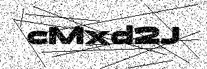

<p align="center">
  
</p>

# ✨ Cloudflare Workers Captcha

This repository contains a Cloudflare Worker that generates CAPTCHA images using a Rust-based WebAssembly (Wasm) module. The CAPTCHA is used to protect web forms from automated submissions (bots) by requiring users to solve a challenge.

> Cloudflare Workers do not support image processing libraries such as **Sharp** or **ImageMagick** at the edge. These libraries are commonly used in Node.js environments for manipulating images, but they cannot be used in the Cloudflare Worker environment due to its limitations.

> To overcome this, the image generation and manipulation are handled by Rust and compiled to WebAssembly, which is supported within Cloudflare Workers. This approach ensures that the CAPTCHA images are generated efficiently and securely at the edge, without relying on unsupported libraries.

## Features

- **Rust-Wasm Integration**: The CAPTCHA generation logic is implemented in Rust, compiled to WebAssembly, and executed within the Cloudflare Worker environment.
- **Dynamic Image Generation**: Each request generates a unique CAPTCHA image in real-time, ensuring that each challenge is different.
- **Base64 Encoded Image**: The CAPTCHA image is returned as a Base64-encoded JPEG image, making it easy to embed directly in HTML.
- **White Background, Black Text**: The CAPTCHA features a white background with black text, with additional noise and bold lines to enhance security.
- **Edge Computing**: Runs at the edge of Cloudflare’s network, providing low-latency responses and scalable protection against bots.


## Installation & Deploy

```sh
yarn install
```

```sh
yarn start
```

```sh
yarn deploy
```

## Endpoints List
  
| Method  | Endpoint | Content-Type | Params |
| --- | --- | --- | --- |
| GET  | / | text/plain (base64) | Generates a random 6-letter CAPTCHA |
| GET  | /{string} | text/plain (base64) | Generates CAPTCHA with {string} |


## WASM Module Build 

Installing Rust
```sh
curl --proto '=https' --tlsv1.2 -sSf https://sh.rustup.rs | sh
cargo install wasm-pack
```

Build module
```sh
cd src/captcha-image-wasm/rust
wasm-pack build --target web
```
